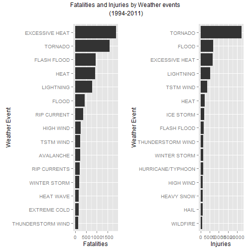
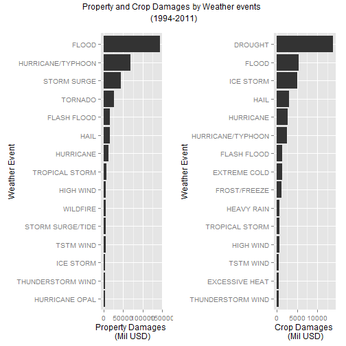

###Synopsis: 

This report analyze U.S. National Oceanic and Atmospheric Administration's (NOAA) storm data from 1994 - 2011. Storm Data is from the National Weather Service. In this peroid, the weather event that causes the most fatalities is Heat. Tornados ause the most injuries. I also found that flood cause most of the property damages, at $1.44B, while drought cause the most damges to crops, at $1.39B. 


###Date Processing:
The data is download as follows:

url<-"http://d396qusza40orc.cloudfront.net/repdata/data/StormData.csv.bz2"

f<-file.path(getwd(), "StormData.csv.bz2")

download.file(url, f)


The data is read by

```r
d<-read.csv(bzfile("StormData.csv.bz2"))
```
The data is organize using dplyr using the following:

```r
library(dplyr) 	

d2<- tbl_df(d)
d2<-select(d2, BGN_DATE, EVTYPE, FATALITIES, INJURIES, PROPDMG, PROPDMGEXP, CROPDMG, CROPDMGEXP)
```
This anlysis is confine the data in the period of 1994 - 2011, since the data is more complete, and it is more representative of recent climate and weather patterns. I used lubridate library to extract the data in this peroid.


```r
library(lubridate)

d2$BGN_DATE<-parse_date_time(d2$BGN_DATE, orders="mdy hms")
d2<-filter(d2, BGN_DATE >= "1994-01-01")
```
**Analysis of weather events most harmful to population health**

I grouped the storm data by weather event and analyzed the number of fatalities and injuries associated with each type of events. This is performed in the following manner:


```r
harm<-select(d2, EVTYPE, FATALITIES, INJURIES)
harm2<-group_by(harm, EVTYPE)
sum_num<-summarise_each(harm2, funs(sum)) 
```
To determine the top 15 weather event that causes the most fatalities, I use the following:

```r
death<-arrange(sum_num, desc(FATALITIES))
death2<-head(select(death, EVTYPE, FATALITIES), 15)
```
To determine the top 15 weather event that causes the most injuries, I use the following:

```r
hurt<-arrange(sum_num, desc(INJURIES))
hurt2<-head(select(hurt, EVTYPE, INJURIES), 15)
```

**Analysis of weather events with greatest economic consequences**
Weather events and the associated property damage is analyzed. I performed data processing using PROPDMGEXP where 'M' or 'm' is represent a factor a million, and 'B' or 'b' means a factor of billion, and 'K' or 'k' represent thousands, etc..I only select data with property damages exceeding thousands of dollars. The base unit is set in Millions dollars. This was performed as follows.

```r
d2_PROP<-select(d2, EVTYPE, PROPDMG, PROPDMGEXP)
d3_PROP<-filter(d2_PROP, PROPDMGEXP == "M" | PROPDMGEXP == "m" | PROPDMGEXP == "B" | PROPDMGEXP == "b" | PROPDMGEXP == "K" | PROPDMGEXP == "k" )
d3_PROP<- mutate(d3_PROP, PROPDMG2 = ifelse((PROPDMGEXP == 'B' | PROPDMGEXP=='b'), PROPDMG*1000, ifelse((PROPDMGEXP == 'K' | PROPDMGEXP=='k'), PROPDMG/1000, PROPDMG)))
```
Extracting the top 15 weather events that cause the most property damges:


```r
PROP<-select(d3_PROP, EVTYPE, PROPDMG2)
PROP2<-group_by(PROP, EVTYPE)
sum_PROP<-summarise_each(PROP2, funs(sum)) 

PROP_DMG<-arrange(sum_PROP, desc(PROPDMG2))
PROP_DMG2<-head(PROP_DMG, 15)
```
Next, I analyze the events associated with the most crop damage using similar approaches as above:

```r
d2_CROP<-select(d2, EVTYPE, CROPDMG, CROPDMGEXP)
d3_CROP<-filter(d2_CROP, CROPDMGEXP == "M" | CROPDMGEXP == "m" | CROPDMGEXP == "B" | CROPDMGEXP == "b" | CROPDMGEXP == "K" | CROPDMGEXP == "k")
d3_CROP<- mutate(d3_CROP, CROPDMG2 = ifelse((CROPDMGEXP == 'B' | CROPDMGEXP=='b'), CROPDMG*1000, ifelse((CROPDMGEXP == 'K' | CROPDMGEXP=='k'), CROPDMG/1000, CROPDMG)))
```

To obtain the top 15 events that cause most crop damage:

```r
CROP<-select(d3_CROP, EVTYPE, CROPDMG2)
CROP2<-group_by(CROP, EVTYPE)
sum_CROP<-summarise_each(CROP2, funs(sum)) 

CROP_DMG<-arrange(sum_CROP, desc(CROPDMG2))
CROP_DMG2<-head(CROP_DMG, 15)
```

###Results:
1.Across the United States, which types of events (as indicated in the EVTYPE variable) are most harmful with respect to population health?
Top 15 events that cause fatalities:

```r
death2
```

```
## Source: local data frame [15 x 2]
## 
##               EVTYPE FATALITIES
## 1     EXCESSIVE HEAT       1903
## 2            TORNADO       1593
## 3        FLASH FLOOD        951
## 4               HEAT        930
## 5          LIGHTNING        794
## 6              FLOOD        450
## 7        RIP CURRENT        368
## 8          HIGH WIND        242
## 9          TSTM WIND        241
## 10         AVALANCHE        224
## 11      RIP CURRENTS        204
## 12      WINTER STORM        195
## 13         HEAT WAVE        172
## 14      EXTREME COLD        150
## 15 THUNDERSTORM WIND        133
```
Top 15 events that cause injuries:

```r
hurt2
```

```
## Source: local data frame [15 x 2]
## 
##               EVTYPE INJURIES
## 1            TORNADO    22571
## 2              FLOOD     6778
## 3     EXCESSIVE HEAT     6525
## 4          LIGHTNING     5116
## 5          TSTM WIND     3631
## 6               HEAT     2095
## 7          ICE STORM     1971
## 8        FLASH FLOOD     1754
## 9  THUNDERSTORM WIND     1476
## 10      WINTER STORM     1298
## 11 HURRICANE/TYPHOON     1275
## 12         HIGH WIND     1099
## 13        HEAVY SNOW      980
## 14              HAIL      943
## 15          WILDFIRE      911
```

These data are plotted using gglot2:

```r
library(ggplot2)
library(gridExtra)
g_death<-ggplot(death2, aes(x=reorder(EVTYPE,FATALITIES), y=FATALITIES))+geom_bar(stat='identity')+coord_flip()+xlab("Weather Event")+ylab("Fatalities")
g_hurt<-ggplot(hurt2, aes(x=reorder(EVTYPE,INJURIES), y=INJURIES))+geom_bar(stat='identity')+coord_flip()+xlab("Weather Event")+ylab("Injuries")

grid.arrange(g_death,g_hurt, nrow = 1, top="Fatalities and Injuries by Weather events\n (1994-2011)")
```

 

Heat causes the most fatalities. Tornado causes the most injuries.

2.Across the United States, which types of events have the greatest economic consequences?
Top 15 events that cause most property damage:


```r
PROP_DMG2
```

```
## Source: local data frame [15 x 2]
## 
##               EVTYPE   PROPDMG2
## 1              FLOOD 144179.609
## 2  HURRICANE/TYPHOON  69305.840
## 3        STORM SURGE  43193.536
## 4            TORNADO  25620.368
## 5        FLASH FLOOD  15716.393
## 6               HAIL  15335.044
## 7          HURRICANE  11862.819
## 8     TROPICAL STORM   7703.386
## 9          HIGH WIND   5266.939
## 10          WILDFIRE   4765.114
## 11  STORM SURGE/TIDE   4641.188
## 12         TSTM WIND   4484.273
## 13         ICE STORM   3832.378
## 14 THUNDERSTORM WIND   3480.404
## 15    HURRICANE OPAL   3172.846
```
Top 15 events that cause most crop damage:

```r
CROP_DMG2
```

```
## Source: local data frame [15 x 2]
## 
##               EVTYPE   CROPDMG2
## 1            DROUGHT 13922.0660
## 2              FLOOD  5506.9424
## 3          ICE STORM  5022.1135
## 4               HAIL  2982.6991
## 5          HURRICANE  2741.4100
## 6  HURRICANE/TYPHOON  2607.8728
## 7        FLASH FLOOD  1402.6615
## 8       EXTREME COLD  1292.9730
## 9       FROST/FREEZE  1094.0860
## 10        HEAVY RAIN   733.3998
## 11    TROPICAL STORM   677.8410
## 12         HIGH WIND   633.5663
## 13         TSTM WIND   553.9973
## 14    EXCESSIVE HEAT   492.4020
## 15 THUNDERSTORM WIND   414.8331
```
These data are plotted as follows

```r
g_prop<-ggplot(PROP_DMG2, aes(x=reorder(EVTYPE,PROPDMG2), y=PROPDMG2))+geom_bar(stat='identity')+coord_flip()+xlab("Weather Event")+ylab("Property Damages \n (Mil USD)")
g_crop<-ggplot(CROP_DMG2, aes(x=reorder(EVTYPE,CROPDMG2), y=CROPDMG2))+geom_bar(stat='identity')+coord_flip()+xlab("Weather Event")+ylab("Crop Damages \n (Mil USD)")

grid.arrange(g_prop,g_crop, nrow = 1, top="Property and Crop Damages by Weather events \n (1994-2011)")
```

 

Flood causes the most property damages. Drought causes the most damages to crops.

